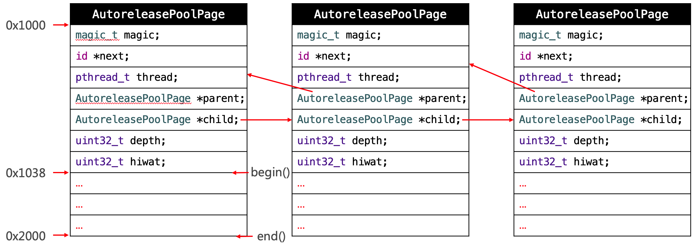

# 内存管理

#### 1、内存布局

iOS程序的内存管理，从低到高分为了6部分，地址由低到高：保留（一部分）、代码段（\_\_TEXT）、数据段（\_\_DATA）、堆（heap）、栈（stack）、内核。和我们开发相关的有中间四部分：

- **代码段**：存储编译之后的代码
- **数据段**：
  - 字符串常量：比如NSString *str = @"123"
  - 已初始化的数据：已初始化的全局变量、静态变量等
  - 未初始化的数据：未初始化的全局变量、静态变量等
- **堆**：通过alloc、malloc、calloc等动态分配的空间，分配的内存空间地址越来越大
- **栈**：函数调用开销，比如局部变量。分配的内存空间地址越来越小


#### 2、TagPoint

从64bit开始，iOS引入了Tagged Pointer技术，用于优化NSNumber、NSDate、NSString等小对象的存储

在没有使用Tagged Pointer之前， NSNumber等对象需要动态分配内存、维护引用计数等，NSNumber指针存储的是堆中NSNumber对象的地址值。

使用Tagged Pointer之后，NSNumber指针里面存储的数据变成了：Tag + Data，也就是将数据直接存储在了指针中，不会再在堆中存储NSNumber对象。但是如果数据偏大，指针中存储不下就会切换到以前的方式存储

nobjc_msgSend能识别Tagged Pointer，比如NSNumber的intValue方法，直接从指针提取数据，节省了以前的调用开销

如何判断一个指针是否为Tagged Pointer？iOS平台，最高有效位是1（第64bit）(底层判断是否是tagpoint的方法是内存地址进行位运算&一个MASK(1UL<<63))

```objective-c
// 使用tagpoint之前
number = 0x10001 ——》地址：0x10001的NSNumber对象 其存储值：10;
// 使用之后
number = 0xb000a1	// a是值，0xb00001是地址
```

面试题：思考以下2段代码能发生什么事？有什么区别？

```objective-c
// 第一段
dispatch_queue_t queue = dispatch_get_global_queue(0, 0);
for (int i = 0; i < 1000; i++) {
    dispatch_async(queue, ^{
        self.name = [NSString stringWithFormat:@"abcdefghijk"];
    });
}

// 第二段
dispatch_queue_t queue = dispatch_get_global_queue(0, 0);
for (int i = 0; i < 1000; i++) {
    dispatch_async(queue, ^{
        self.name = [NSString stringWithFormat:@"abc"];
    });
}
```

第一段会crash，crash的原因是坏内存地址访问。由于字符串`abcdefghijk`过长，需要在数据区存储这个字符串，然后将这个地址赋值给属性`name`，每次给`name`设置新的属性的时候会经历以下步骤，release，retain

```objective-c
- (void)setName:(NSString *)name
{
    if (_name != name) {
        [_name release];
        _name = [name retain];
    }
}
```

由于多线程异步访问，同一个_name地址会同时多次调用release因而造成坏地址访问。

第二段就不会存在这个问题，因为字符串`abc`比较小，系统会将其存放在栈区的指针地址中，每一次赋值只会修改`_name`的值而不会进行其他release和retain操作。


#### 3、OC对象的内存管理

- **原理**

在iOS中，使用引用计数来管理OC对象的内存：

一个新创建的OC对象引用计数默认是1，当引用计数减为0，OC对象就会销毁，释放其占用的内存空间。

调用retain会让OC对象的引用计数+1，调用release会让OC对象的引用计数-1。

内存管理的经验总结：

当调用alloc、new、copy、mutableCopy方法返回了一个对象，在不需要这个对象时，要调用release或者autorelease来释放它；

想拥有某个对象，就让它的引用计数+1；不想再拥有某个对象，就让它的引用计数-1。

**MRC（Manual Reference Counting）**下需要自己对对象进行管理，对创建的对象需要手动调用release将其释放，或者在init时进行autorelease操作；

**ARC**下就不需要再手动对其进行内存管理，系统会自动管理引用计数。但是调用CF等C语言库的时候还是需要进行手动内存管理的。


- **引用计数器的存储**：

在64bit中，引用计数可以直接存储在优化过的isa指针中，也可能存储在SideTable类中（引用计数器过大时会存储在这里）

```objective-c
// isa_t 共用体中的信息：
unitptr_t has_sidetable_rc		: 1; // 引用计数器是否过大无法存储在isa中,如果为1，那么引用计数会存储在一个叫SideTable的类的属性中
unitpyr_t extra_rc				: 1; // 里面存储的值是引用计数器减

// SideTable结构体
struct SideTable {
    spinlock_t slock;
    RefcountMap refcnts; // 一个存放着对象引用计数的散列表
    weak_table_t weak_table; // 弱引用的散列表
}
```


- **dealloc：释放对象**

  当一个对象要释放时，会自动调用dealloc，接下的调用轨迹是
   - dealloc

   - _objc_rootDealloc

   - rootDealloc

   - object_dispose

   - objc_destructInstance、free

     ```objective-c
     void objc_destructInstance(id obj) {
         bool cxx = obj->hasCxxDtor();
         bool assoc = obj->hasAssociatedObjects();
         if(cxx) object__cxxDestruct(obj); // 清除属性
         if(assoc) object_remove_assocations(obj); // 清除关联对象
         obj->clearDeallocating(); // 清除弱引用，将指向当前对象的若指针设为nil
     }
     ```

- **strong weak对比**

  **__strong**：强引用，计数器+1

  **__weak**：弱引用，计数器不变，引用的对象销毁，指针会被设为nil

  **__unsafe_unretained**：弱引用，计数器不变，引用的对象销毁，指针不会被设为nil

#### 4、Copy、MutableCopy

**拷贝的目的**：产生一个副本对象，与源对象互不影响。即修改了源对象，不会影响副本对象；修改了副本对象，不会影响源对象。

iOS提供了2个拷贝方法：

**copy**，不可变拷贝，产生不可变副本；

**mutableCopy**，可变拷贝，产生可变副本

**深拷贝**和**浅拷贝**

 1.深拷贝：内容拷贝，产生新的对象

 2.浅拷贝：指针拷贝，没有产生新的对象

下面这份表是对iOS集合进行copy或mutableCopy后的总结

|                     | copy                  | mutableCopy                  |
| ------------------- | --------------------- | ---------------------------- |
| NSString            | NSString   浅拷贝     | NSMutableString   深拷贝     |
| NSMutableString     | NSString   深拷贝     | NSMutableString   深拷贝     |
| NSArray             | NSArray   浅拷贝      | NSMutableArray   深拷贝      |
| NSMutableArray      | NSArray   深拷贝      | NSMutableArray   深拷贝      |
| NSDictionary        | NSDictionary   浅拷贝 | NSMutableDictionary   深拷贝 |
| NSMutableDictionary | NSDictionary   深拷贝 | NSMutableDictionary   深拷贝 |


面试题：

在给对象定义**不可变集合**（NSString、NSArray、NSDictionary）属性时为什么使用copy。

为了保证数据不被外部修改。如果给属性赋值的源数据是可变集合，并且集合属性没有用copy，那么源数据修改时就会影响到此属性。


#### 5、自动释放池

自动释放池的主要底层数据结构是：__AtAutoreleasePool、AutoreleasePoolPage

调用了autorelease的对象最终都是通过AutoreleasePoolPage对象来管理的

- **AutoreleasePoolPage的结构**

  - 每个AutoreleasePoolPage对象占用4096字节内存，除了用来存放它内部的成员变量，剩下的空间用来存放autorelease对象的地址

  - 所有的AutoreleasePoolPage对象通过双向链表的形式连接在一起，如下图

  

  - 调用push方法会将一个POOL_BOUNDARY入栈，并且返回其存放的内存地址

  - 调用pop方法时传入一个POOL_BOUNDARY的内存地址，会从最后一个入栈的对象开始发送release消息，直到遇到这个POOL_BOUNDARY

  - id *next指向了下一个能存放autorelease对象地址的区域  

- **Runloop和Autorelease**

  iOS在主线程的Runloop中注册了2个Observer

  - 第1个Observer监听了kCFRunLoopEntry事件，会调用objc_autoreleasePoolPush()

  - 第2个Observer：

    - 监听了kCFRunLoopBeforeWaiting事件，会调用objc_autoreleasePoolPop()、objc_autoreleasePoolPush()

    - 监听了kCFRunLoopBeforeExit事件，会调用objc_autoreleasePoolPop()


  面试题：局部OC对象会在什么时候销毁？出了方法或函数就被销毁么？

  会在当前线程的runloop进入kCFRunLoopBeforeWaiting或者kCFRunLoopBeforeExit状态时才进行销毁，也就是说方法或函数结束后并不会马上被销毁。同样，autorelease也是在监听到了这两个状态才会执行release操作。


#### 6、Timer定时器

- **问题**：

CADisplayLink、NSTimer会对target产生强引用，如果target又对它们产生强引用，那么就会引发循环引用

- **解决方案**

  - **方案1**：NSTimer：调用含有block的API，然后weak target

  - **方案2**：使用代理对象（NSProxy）

    利用消息的转发机制，将定时器的target找个第三方对象介入，来解除循环引用。

    方法调用流程：阶段一，isa递归查找方法；阶段二，动态方法解析；阶段三，消息转发。

    - 1、实现一个类，继承自NSProxy；

    - 2、创建定时器的时候，将target用这个类的实例对象取代；

    - 3、在这个类中实现消息转发方法，将方法调用转发给原target

      ```objective-c
      // timer创建
      self.timer = [NSTimer scheduledTimerWithTimeInterval:1.0 target:[MJProxy proxyWithTarget:self] selector:@selector(timerTest) userInfo:nil repeats:YES];
      
      // 类申明
      @interface KKProxy : NSProxy
      + (instancetype)proxyWithTarget:(id)target;
      @property (weak, nonatomic) id target;
      @end
          
      // 实现
      @implementation KKProxy
      
      + (instancetype)proxyWithTarget:(id)target
      {
          // NSProxy对象不需要调用init，因为它本来就没有init方法
          KKProxy *proxy = [KKProxy alloc];
          proxy.target = target;
          return proxy;
      }
      
      // 消息转发
      - (NSMethodSignature *)methodSignatureForSelector:(SEL)sel
      {
          return [self.target methodSignatureForSelector:sel];
      }
      
      - (void)forwardInvocation:(NSInvocation *)invocation
      {
          [invocation invokeWithTarget:self.target];
      }
      @end
      ```

  **NSProxy**：这个类等同于NSObject，内部只有一个isa指针，不继承任何类

  它的方法调用，不是NSObject及其子类那样经过isa找方法调用，它是直接调用消息转发机制进行方法调用。它的存在就是为了消息转发。


- **GCD定时器**

  NSTimer依赖于RunLoop，如果RunLoop的任务过于繁重，可能会导致NSTimer不准时

  而GCD的定时器会更加准时，它独立于runloop，内核实现的

  ```objective-c
  @property (strong, nonatomic) dispatch_source_t timer;
  - (void)createTimer {
      // 队列
      //    dispatch_queue_t queue = dispatch_get_main_queue();
      dispatch_queue_t queue = dispatch_queue_create("timer", DISPATCH_QUEUE_SERIAL);
      
      // 创建定时器
      dispatch_source_t timer = dispatch_source_create(DISPATCH_SOURCE_TYPE_TIMER, 0, 0, queue);
      
      // 设置时间
      uint64_t start = 2.0; // 2秒后开始执行
      uint64_t interval = 1.0; // 每隔1秒执行
      dispatch_source_set_timer(timer,
                                dispatch_time(DISPATCH_TIME_NOW, start * NSEC_PER_SEC),
                                interval * NSEC_PER_SEC, 0);
      
      // 设置回调
      //    dispatch_source_set_event_handler(timer, ^{
      //        NSLog(@"1111");
      //    });
      dispatch_source_set_event_handler_f(timer, timerFire);
      
      // 启动定时器
      dispatch_resume(timer);
      
      self.timer = timer;
  }
  
  void timerFire(void *param) {
      NSLog(@"kkkkkkkkkkkk - %@", [NSThread currentThread]);
  }
  
  ```

  封装个定时器：

  ```objective-c
  // .h
  #import <Foundation/Foundation.h>
  @interface KKTimer : NSObject
  
      
   /**
   创建定时器
  
   @param task 任务block
   @param start 开始时间
   @param interval 时间间隔
   @param repeats 是否重复
   @param async 同步、异步
   @return 返回定时器标识
   */
  
  + (NSString *)execTask:(void(^)(void))task
             start:(NSTimeInterval)start
          interval:(NSTimeInterval)interval
           repeats:(BOOL)repeats
             async:(BOOL)async;
  
  + (NSString *)execTask:(id)target
                selector:(SEL)selector
                   start:(NSTimeInterval)start
                interval:(NSTimeInterval)interval
                 repeats:(BOOL)repeats
                   async:(BOOL)async;
  
  /**
   销毁定时器
   @param name 定时器标识
   */
  + (void)cancelTask:(NSString *)name;
  
  @end
      
      
      
  // .m
  #import "KKTimer.h"
  
  @implementation KKTimer
  
  static NSMutableDictionary *timers_;
  dispatch_semaphore_t semaphore_;
  + (void)initialize
  {
      static dispatch_once_t onceToken;
      dispatch_once(&onceToken, ^{
          timers_ = [NSMutableDictionary dictionary];
          semaphore_ = dispatch_semaphore_create(1);
      });
  }
  
  + (NSString *)execTask:(void (^)(void))task start:(NSTimeInterval)start interval:(NSTimeInterval)interval repeats:(BOOL)repeats async:(BOOL)async
  {
      if (!task || start < 0 || (interval <= 0 && repeats)) return nil;
      
      // 队列
      dispatch_queue_t queue = async ? dispatch_get_global_queue(0, 0) : dispatch_get_main_queue();
      
      // 创建定时器
      dispatch_source_t timer = dispatch_source_create(DISPATCH_SOURCE_TYPE_TIMER, 0, 0, queue);
      
      // 设置时间
      dispatch_source_set_timer(timer,
                                dispatch_time(DISPATCH_TIME_NOW, start * NSEC_PER_SEC),
                                interval * NSEC_PER_SEC, 0);
      
      // 信号锁，保证其安全，可以多线程同时使用定时器
      dispatch_semaphore_wait(semaphore_, DISPATCH_TIME_FOREVER);
      // 定时器的唯一标识
      NSString *name = [NSString stringWithFormat:@"%zd", timers_.count];
      // 存放到字典中
      timers_[name] = timer;
      dispatch_semaphore_signal(semaphore_);
      
      // 设置回调
      dispatch_source_set_event_handler(timer, ^{
          task();
          
          if (!repeats) { // 不重复的任务
              [self cancelTask:name];
          }
      });
      
      // 启动定时器
      dispatch_resume(timer);
      
      return name;
  }
  
  + (NSString *)execTask:(id)target selector:(SEL)selector start:(NSTimeInterval)start interval:(NSTimeInterval)interval repeats:(BOOL)repeats async:(BOOL)async
  {
      if (!target || !selector) return nil;
      
      return [self execTask:^{
          if ([target respondsToSelector:selector]) {
  #pragma clang diagnostic push
  #pragma clang diagnostic ignored "-Warc-performSelector-leaks"
              [target performSelector:selector];
  #pragma clang diagnostic pop
          }
      } start:start interval:interval repeats:repeats async:async];
  }
  
  + (void)cancelTask:(NSString *)name
  {
      if (name.length == 0) return;
      
      dispatch_semaphore_wait(semaphore_, DISPATCH_TIME_FOREVER);
      
      dispatch_source_t timer = timers_[name];
      if (timer) {
          dispatch_source_cancel(timer);
          [timers_ removeObjectForKey:name];
      }
  
      dispatch_semaphore_signal(semaphore_);
  }
  
  @end
  
  ```
