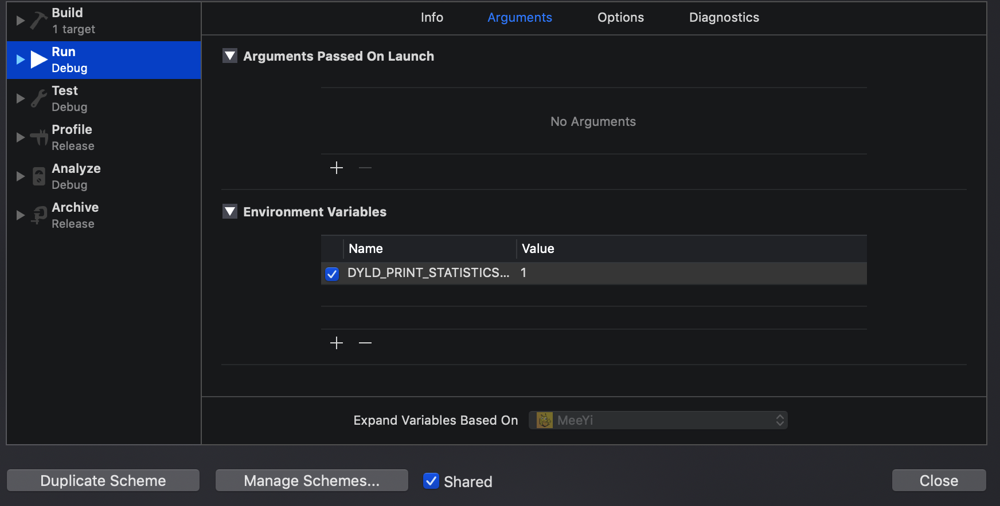

# iOS应用启动时做了哪些工作&启动时间优化

先来看看Xcode9新加的神器，如下图

通过添加环境变量可以打印出APP的启动时间分析（Edit scheme -> Run -> Arguments），DYLD_PRINT_STATISTICS设置为1，如果查看更详细的信息可以DYLD_PRINT_STATISTICS_DETAILS设置为1。




然后启动应用，即可查看到以下信息

```shell
Total pre-main time: 588.23 milliseconds (100.0%)
         dylib loading time: 264.36 milliseconds (44.9%)
        rebase/binding time:  56.19 milliseconds (9.5%)
            ObjC setup time:  49.84 milliseconds (8.4%)
           initializer time: 217.71 milliseconds (37.0%)
           slowest intializers :
             libSystem.B.dylib :   9.18 milliseconds (1.5%)
    libMainThreadChecker.dylib :  36.42 milliseconds (6.1%)
          libglInterpose.dylib :  82.35 milliseconds (14.0%)
         libMTLInterpose.dylib :  32.51 milliseconds (5.5%)
                         MeeYi :  24.89 milliseconds (4.2%)
```

可以看到，在执行main函数前，应用准备了4个方面：**dylib loading**、**rebase/binding**、**ObjC setup**、**initializer**，下面我们将好好分析这几个方面。

#### 启动工作

- **load dylibs**：加载动态库，包括系统的、自己添加的（第三方的），递归一层一层加载所依赖的库。
- **Rebase&Bind**：修复指针，mach-o内部的存储逻辑是，信息的存储地址是虚拟内存，不是直接对应物理内存；每一次应用启动的时候，内存的开始地址又是随机的，因此需要对接虚拟内存和物理内存地址。为了安全，防止黑客攻击。
- **Objc**：注册类信息到全局Table中
- **Initializers**：初始化部分，+load方法初始化，C/C++静态初始化对象和标记`__attribute__(constructor)`的方法
- **Main()**：执行main函数，执行APPDelegate的方法
- **加载Window+加载RootViewController+初始化操作**：主要在```didFinishLaunchingWithOptions```执行操作，比如初始化第三方库，初始化基础信息，加载RootViewController等


#### 启动时间优化

- **启动时间了解**

启动时间是用户点击App图标，到第一个界面展示的时间。

启动时间在小于400ms是最佳的，因为从点击图标到显示Launch Screen，到Launch Screen消失这段时间是400ms。启动时间不可以大于20s，否则会被系统杀掉。

查看启动时间

在Xcode中，可以通过设置环境变量来查看App的启动时间，这里查看的主要是main函数之前的，`DYLD_PRINT_STATISTICS`和`DYLD_PRINT_STATISTICS_DETAILS`。

```
Total pre-main time: 560.65 milliseconds (100.0%)
         dylib loading time: 266.19 milliseconds (47.4%)
        rebase/binding time:  37.60 milliseconds (6.7%)
            ObjC setup time:  48.74 milliseconds (8.6%)
           initializer time: 207.98 milliseconds (37.0%)
           slowest intializers :
             libSystem.B.dylib :   8.47 milliseconds (1.5%)
    libMainThreadChecker.dylib :  36.20 milliseconds (6.4%)
          libglInterpose.dylib :  76.54 milliseconds (13.6%)
         libMTLInterpose.dylib :  31.91 milliseconds (5.6%)
                         MeeYi :  23.31 milliseconds (4.1%)
```


- **启动时间优化**

  - **main()函数之前：**

    - #### dylibs：加载动态库 

      启动的第一步是加载动态库，加载系统的动态库使很快的，因为可以缓存，而加载内嵌的动态库速度较慢。所以，提高这一步的效率的关键是：减少动态库的数量。

      ```合并动态库，比如公司内部由私有Pod建立了如下动态库：XXTableView, XXHUD, XXLabel，强烈建议合并成一个XXUIKit来提高加载速度。```

    - #### Rebase & Bind & Objective C Runtime

      Rebase和Bind都是为了解决指针引用的问题。对于Objective C开发来说，主要的时间消耗在Class/Method的符号加载上，所以常见的优化方案是：

      - 减少__DATA段中的指针数量。
      - 合并Category和功能类似的类。比如：UIView+Frame,UIView+AutoLayout…合并为一个
        删除无用的方法和类。
      - 多用Swift Structs，因为Swfit Structs是静态分发的。

    - #### Initializers

      通常，我们会在+load方法中进行method-swizzling，这也是Nshipster推荐的方式。

      - 用initialize替代load。不少同学喜欢用method-swizzling来实现AOP去做日志统计等内容，强烈建议改为在initialize进行初始化。
      - 减少__atribute__((constructor))的使用，而是在第一次访问的时候才用dispatch_once等方式初始化。
      - 不要创建线程

      - 使用Swfit重写代码。

  - **main()函数之后：**

    **优化的核心思想：能延迟初始化的尽量延迟初始化，不能延迟初始化的尽量放到后台初始化。**

    我们首先来分析下，从main函数开始执行，到你的第一个界面显示，这期间一般会做哪些事情。

    - 执行AppDelegate的代理方法，主要是```didFinishLaunchingWithOptions，applicationDidBecomeActive```，
    - 初始化第三方skd
    - 初始化Window，初始化基础的ViewController
    - 获取数据(Local DB／Network)，展示给用户。


    接下来借助工具来查找优化

    - 知道这个过程后，可以借助**Time Profiler**工具查找具体的耗时模块

      几点要注意：

      - 分析启动时间，一般只关心主线程
      - 选择Hide System Libraries和Invert Call Tree，这样我们能专注于自己的代码
      - 右侧可以看到详细的调用堆栈信息


    - 另外，也可以借用C语言函数查看模块运行时间：

    ```
    CFTimeInterval startTime = CACurrentMediaTime();
    //执行方法
    CFTimeInterval endTime = CACurrentMediaTime();
    ```
